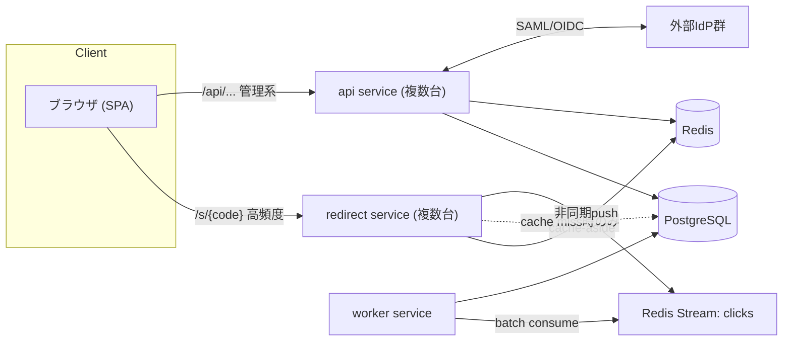
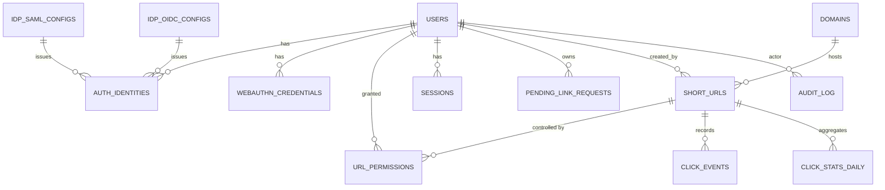

# 短縮URLシステム アーキテクチャ設計書

## Context

組織内では現在 [YOURLS](https://github.com/YOURLS/YOURLS) を用いて、管理者が短縮URLを登録・運用している。しかし以下の課題があり、YOURLSの拡張ではなく新規システムを開発する方針とした。

- 実装が古く、モダンなアーキテクチャで作り直したい
- UIをモダンにしたい
- YOURLSでは短縮URLごとにオーナーが1人だけで、複数人での共同管理ができない
- YOURLSではログインできる人なら誰でも他人の短縮URLのアクセス統計を閲覧できてしまう(アクセス制御の欠如)

このドキュメントは、上記課題を解決する新システムのアーキテクチャ設計をまとめたものである。今回のセッションでは**設計のみ**を行い、リポジトリ作成やコード実装は別途行う。技術スタックは **バックエンド: Go / フロントエンド: TypeScript** に確定済み。

### 確定した要件・ポリシー(ユーザ確認済み)

- ロール: 一般ユーザ(短縮URL登録・管理) / システム管理者(認証設定含むシステム設定 + 一般ユーザ操作)
- 認証: ローカル(パスキー対応、セルフサインアップON/OFF可)、SAML(複数IdP)、OIDC(複数IdP)を管理者が個別に有効化・併用可能
- ユーザ識別子はメールアドレス。認証方式が異なっても同一メールなら同一人物として統合する
- 短縮URLは複数の共同管理者(owner/editor/viewer)を持てる。アクセス統計は権限を持つユーザのみ閲覧可能
- **system_adminは全短縮URLの統計を無制限に閲覧可能**(YOURLSと同様の運用でよいと確認済み)
- アカウント統合(リンク)ポリシー: **信頼済みSSOは自動統合、それ以外(未信頼SAML/未検証OIDC/ローカルセルフサインアップ)は確認メール必須**
- **既存YOURLSデータの移行が必要**
- カスタムドメイン対応は現時点では不要だが、将来必要になる可能性があるため、スキーマは拡張しやすくしておく

### 未決事項の確定結果(ユーザ確認済み・全7件)

| 論点 | 確定内容 |
|---|---|
| IPアドレスの取り扱い | ソルト付きハッシュ化して `click_events.ip_hash` に保存 |
| 短縮コード生成方式 | ユーザによるカスタムエイリアス指定を許可(推奨)。未指定時は管理者が設定した文字集合・文字数でランダム生成 |
| 短縮コード設定変更の影響範囲 | 設定変更は以後の新規ランダム生成にのみ適用され、既存の短縮URLには影響しない |
| YOURLS移行時のオーナー割当 | 組織側が用意するCSV対応表(keyword→担当者メール)で事前確定 |
| click_eventsの生ログ保持期間 | 無期限保存(削除・アーカイブジョブなし) |
| SAML Single Logout(SLO) | 対応不要 |
| リダイレクトのレート制限 | プロセス内(インスタンスローカル)の制限のみ実装。Redis等による集中管理は行わない |
| 監査ログ(audit_log)の保持期間・SIEM連携 | 無期限保存、外部SIEM連携は行わない |

---

## 1. 全体アーキテクチャ概要

### 1.1 サービス構成

単一のGoモジュール(モノレポ)から、責務の異なる複数のデプロイ単位(バイナリ)を生成する「モジュラーモノリス」構成とする。

```
repo/
  cmd/
    api/         # 管理系API + 認証(SAML/OIDC/WebAuthn) + 統計API
    redirect/    # リダイレクト専用サーバ(高頻度アクセスのホットパス)
    worker/      # 非同期クリックロギング、統計集計バッチ、SAML/OIDCメタデータ更新
    migrate-yourls/  # YOURLSデータ移行用ワンショットCLI
  internal/
    auth/        # 認証コア(identity統合ロジック含む・api/workerで共有)
    shorturl/    # 短縮URLドメインロジック
    permission/  # URL単位権限
    stats/       # 統計集計
    storage/     # DBアクセス層(sqlc生成コード)
    cache/       # Redis/in-memoryキャッシュ抽象化
  web/           # フロントエンド(React + TypeScript)
```

**理由**: `redirect` はアクセス頻度・SLA要求が `api` と全く異なる(可用性最優先・低レイテンシ・ステートレス)。バイナリを分離することでリダイレクトだけを個別にスケールでき、管理画面の重い集計クエリやSAML/OIDCのTLS処理がリダイレクトのレイテンシに影響しない。一方でドメインロジックは同一モジュール内の `internal` パッケージを共有し重複を避ける。

### 1.2 構成図



### 1.3 主要な設計方針

- リダイレクトはRedisキャッシュのみで完結させ、DBはキャッシュミス時のフォールバック
- クリックイベント記録はリダイレクト応答をブロックしない(非同期・at-least-once許容)
- 認証は `internal/auth` に集約し、SAML/OIDC/ローカル/パスキーいずれの経路でも「ユーザ識別・アカウント統合」ロジックを一本化する(分散させるとセキュリティホールの温床になる)
- 管理者の設定変更、権限付与、アカウント統合イベントは全て監査ログに記録する

---

## 2. データモデル

### 2.1 ER図



### 2.2 テーブル概要

**users** — ユーザマスタ(認証方式を問わず1レコード)

| カラム | 型 | 備考 |
|---|---|---|
| id | uuid PK | |
| email | citext UNIQUE NOT NULL | 統合キー。大文字小文字無視 |
| email_verified | boolean | いずれかの認証で検証済みか |
| display_name | text | |
| is_system_admin | boolean | |
| status | enum(active, suspended) | |
| created_at / updated_at | timestamptz | |

**auth_identities** — 外部/ローカル認証との紐付け(1ユーザに複数可)

| カラム | 型 | 備考 |
|---|---|---|
| id | uuid PK | |
| user_id | uuid FK -> users | |
| provider_type | enum(local, saml, oidc) | |
| provider_config_id | uuid NULL | idp_saml_configs/idp_oidc_configsのFK(localはNULL) |
| subject | text | IdP側識別子(NameID/sub) |
| email_at_link | citext | リンク時点のメール(再割当て検知用) |
| verified | boolean | |
| created_at / last_used_at | timestamptz | |
| UNIQUE(provider_type, provider_config_id, subject) | | |

**local_credentials**

| カラム | 型 | 備考 |
|---|---|---|
| user_id | uuid PK/FK | |
| password_hash | text NULL | argon2id |
| failed_attempts / locked_until | int / timestamptz | ブルートフォース対策 |

**webauthn_credentials**(パスキー)

| カラム | 型 | 備考 |
|---|---|---|
| id | uuid PK | |
| user_id | uuid FK | |
| credential_id | bytea UNIQUE | |
| public_key | bytea | |
| sign_count | bigint | クローン検知 |
| transports | text[] | |

**idp_saml_configs**

| カラム | 型 | 備考 |
|---|---|---|
| id | uuid PK | |
| name | text | ログイン画面表示名 |
| idp_entity_id / idp_sso_url / idp_certificate | text | |
| email_attribute | text | 属性名マッピング |
| trusted | boolean | 自動統合可否の判定に使用(3.4節) |
| enabled | boolean | |

**idp_oidc_configs**

| カラム | 型 | 備考 |
|---|---|---|
| id | uuid PK | |
| name | text | |
| issuer | text | Discovery URLベース |
| client_id / client_secret_encrypted | text | secretは暗号化保存 |
| scopes | text[] | 既定 `openid email profile` |
| require_email_verified_claim | boolean | 既定true |
| enabled | boolean | |

**auth_settings**(単一行のシステム設定)

| カラム |
|---|
| local_auth_enabled |
| self_signup_enabled |
| require_email_confirmation_for_signup |

**short_code_settings**(単一行のシステム設定・短縮コード生成ポリシー)

| カラム | 型 | 備考 |
|---|---|---|
| charset | text | ランダム生成に使う文字集合(例: Base62) |
| length | int | ランダム生成する文字数 |
| updated_at | timestamptz | |

生成ロジックは生成時点でこの設定を読み取るだけで、既に発行済みの `short_urls.short_code` は文字列として確定済みのため、設定変更後も過去分は一切影響を受けない(バージョニング等の追加機構は不要)。

**pending_link_requests**(アカウント統合の確認フロー用)

| カラム | 型 | 備考 |
|---|---|---|
| id | uuid PK | |
| existing_user_id | uuid FK | |
| candidate_provider_type / provider_config_id / subject | | |
| token_hash | text | 確認メール内トークン |
| expires_at | timestamptz | 例: 30分 |
| confirmed_at | timestamptz NULL | |

**domains** — カスタムドメイン対応のため今から用意(初期は1レコードのみ運用)

| カラム | 型 | 備考 |
|---|---|---|
| id | uuid PK | |
| hostname | text UNIQUE | 例: `go.example.com` |
| is_default | boolean | |

**short_urls**

| カラム | 型 | 備考 |
|---|---|---|
| id | uuid PK | |
| domain_id | uuid FK -> domains | 初期は常に唯一のデフォルトドメイン |
| short_code | text NOT NULL | ユーザ指定のカスタムエイリアス、または `short_code_settings` に従ったランダム生成 |
| long_url | text NOT NULL | |
| title / description | text | |
| created_by | uuid FK -> users | 移行データはmigration用システムユーザ(11節) |
| status | enum(active, disabled, expired) | |
| expires_at | timestamptz NULL | |
| source | enum(native, yourls_import) | 移行元の識別(11節) |
| created_at / updated_at | timestamptz | |
| UNIQUE(domain_id, short_code) | | ドメイン単位でユニーク |

**url_permissions**

| カラム | 型 | 備考 |
|---|---|---|
| id | uuid PK | |
| short_url_id | uuid FK | |
| user_id | uuid FK | |
| role | enum(owner, editor, viewer) | |
| granted_by | uuid FK -> users | |
| granted_at | timestamptz | |
| UNIQUE(short_url_id, user_id) | | |

**click_events**(生ログ、月次パーティション推奨)

| カラム | 型 | 備考 |
|---|---|---|
| id | bigint identity / ULID | |
| short_url_id | uuid FK | |
| clicked_at | timestamptz | |
| referrer_host | text NULL | ホストのみ保持(プライバシー配慮) |
| user_agent_raw | text | |
| ip_hash | text | 生IPは保持しない(ソルト付きハッシュ) |
| country_code | text NULL | 非同期GeoIP解決 |

保持期間は無期限とし、削除・アーカイブ用のバッチジョブは設けない。

**click_stats_daily**(集計ロールアップ)

| カラム | 型 |
|---|---|
| short_url_id | uuid |
| date | date |
| click_count | bigint |
| PRIMARY KEY(short_url_id, date) | |

**sessions**(サーバサイドセッション、5節)

| カラム | 型 |
|---|---|
| id(セッショントークンhash) | text PK |
| user_id | uuid FK |
| created_at / expires_at / last_seen_at | timestamptz |

**audit_log**

| カラム | 型 | 備考 |
|---|---|---|
| id | uuid PK | |
| actor_user_id | uuid NULL | システム動作の場合NULL |
| action | text | 例: `account.link`, `permission.grant`, `auth_settings.update`, `stats.admin_view` |
| target_type / target_id | text | |
| metadata | jsonb | |
| created_at | timestamptz | |

保持期間は無期限とし、外部SIEM連携は行わない。

---

## 3. 認証フロー設計

### 3.1 ローカル認証 + パスキー(WebAuthn)

**セルフサインアップ(有効時)**
1. メール+パスワードでサインアップ要求
2. `require_email_confirmation_for_signup` がtrueなら確認メール送信、リンク踏むまで `email_verified=false`
3. 既に同一メールで既存ユーザが存在する場合 → 3.4節のポリシーに従う(確認メール必須)

**パスキー**: ログイン済みユーザが追加登録するモデル。`go-webauthn` の `BeginRegistration`/`FinishRegistration`、ログイン時は `BeginLogin`/`FinishLogin` で `sign_count` を検証しクローン検知する。

### 3.2 SAML認証(複数IdP)

- SP初期化: `/auth/saml/{idp_config_id}/login` → AuthnRequestをIdPへ
- ACS: `/auth/saml/{idp_config_id}/acs` でAssertion署名検証、Replay対策のためAssertion IDを記録
- `email_attribute` 設定に従い属性からメール抽出
- Single Logout(SLO)は対応不要と確定(ログアウトはIdP側と連動せず、本システムのセッション有効期限・管理者による強制失効のみで対応)

### 3.3 OIDC認証(複数IdP)

- Authorization Code + PKCE(`state`, `nonce` 必須検証)
- `/auth/oidc/{idp_config_id}/login` → Discovery → Authorization Endpoint
- Callback: `/auth/oidc/{idp_config_id}/callback` でトークン検証、`email`/`email_verified` クレーム取得
- `require_email_verified_claim=true`(既定)で `email_verified=false` のIdPからのログインは3.4節のフローへ

### 3.4 アカウント統合ロジックとセキュリティ(最重要論点・確定ポリシー)

**リスク**: メールアドレスによる自動アカウント統合は、検証されていないメールクレームや詐称セルフサインアップにより、なりすまし・アカウント乗っ取りを招きうる。

**確定ポリシー: 「信頼済みSSOは自動統合、それ以外は確認メール必須」**

1. **OIDC**: `idp_oidc_configs.require_email_verified_claim=true`(既定)かつ `email_verified=true` のクレームを持つIdPからのログインは自動統合。falseの場合は確認メールフローへ。
2. **SAML**: 標準の検証済みフラグが存在しないため、`idp_saml_configs.trusted` を管理者が明示的に設定する運用とする。`trusted=true`(例: 社内ADFS/Entra ID等、組織が完全管理するIdP)は自動統合、それ以外は確認メールフローへ。
3. **ローカルセルフサインアップ**: 新規メールでのサインアップは無条件で新規ユーザ作成可。ただし、そのメールが既にSSO(信頼済み)側の `auth_identities` に存在する場合は、セルフサインアップを拒否するか確認メールフロー(本人確認)に倒す。これが詐称登録対策の本丸。
4. **確認メールフロー**: `pending_link_requests` にトークンを発行し、既存ユーザの登録メール宛に承認リンクを送付。承認後に `auth_identities` を追加してログイン成立。有効期限は30分。
5. **メール再割当て対策**: `auth_identities.email_at_link` を記録し、IdP側で返るメールが変化した場合は自動再統合せず再確認フローに回す。
6. **監査ログ**: 全ての `account.link` イベントを記録し、管理者が事後レビュー・不審な統合を取り消せるようにする。

---

## 4. 権限モデル

### 4.1 システムレベル

| ロール | 権限 |
|---|---|
| system_admin | 認証方式・IdP設定・self-signup可否等のシステム設定変更、全ユーザ管理、**全短縮URLの統計・詳細を無制限に閲覧可能**、一般ユーザとしての短縮URL操作 |
| user(一般ユーザ) | 自身が作成/招待された短縮URLの管理のみ |

system_adminによる他者URLの閲覧は無制限に許可するが、`audit_log` に `stats.admin_view` として記録し、透明性を確保する(閲覧のブロックはしないが、証跡は残す)。

### 4.2 短縮URL単位

| ロール | 閲覧(統計含む) | 編集 | 権限管理(招待/削除) | URL削除 |
|---|---|---|---|---|
| owner | ○ | ○ | ○ | ○ |
| editor | ○ | ○ | × | × |
| viewer | ○ | × | × | × |

- 作成時に作成者が自動的に `owner` となる。owner は複数人設定可(共同オーナーシップ)
- owner は他ユーザを editor/viewer として招待可能
- 統計は `url_permissions` にレコードを持つユーザ(またはsystem_admin)のみアクセス可能。それ以外には存在自体を秘匿(403ではなく404を返す)

---

## 5. API設計方針

### 5.1 REST/JSON

管理系API(短縮URL CRUD、権限管理、統計取得、認証設定)はREST+JSONを採用。OpenAPI(`oapi-codegen`)でスキーマ駆動開発とする。GraphQLは要件に対して過剰と判断。

### 5.2 セッション管理: Cookie + サーバサイドセッション

| 観点 | Cookie+サーバサイドセッション | JWT(ステートレス) |
|---|---|---|
| 即時失効 | 容易(Redisレコード削除) | 困難 |
| SAML SLOとの整合性 | 良い | 悪い |
| XSS/CSRF | HttpOnly Cookie + CSRFトークンで対応 | Bearerなら CSRF不要だがXSSに弱い |

退職者対応やなりすまし検知時の「即座に権限を剥奪できること」を重視し、**Cookie(HttpOnly, Secure, SameSite=Lax) + サーバサイドセッション(Redis保存)** を採用。JWTは将来的な内部サービス間通信や外部連携用トークンとして限定利用の余地を残す。

---

## 6. リダイレクトサービスの高速化方針

0. **レート制限はプロセス内(インスタンスローカル)のみ**で実装する。`golang.org/x/time/rate` によるIPごとのトークンバケットをキャッシュ参照の前段に置く。Redis等による集中管理は行わない(往復レイテンシが載ることでキャッシュヒット時のマイクロ秒台の応答が数百μs〜1ms級に悪化するのを避けるため)。複数インスタンス構成では上限は「設定値 × インスタンス数」相当になる点は許容する
1. `short_code -> long_url` マッピングをRedis(cache-aside)+ in-process LRU(`dgraph-io/ristretto`)の2段キャッシュに保持
2. 更新・削除・無効化時はAPIサービスが該当キーをpurgeし、Pub/Subで各redirectインスタンスのin-processキャッシュにも伝播
3. キャッシュミス時のみPostgreSQLへフォールバック
4. クリックロギングは302応答後に非同期でRedis Stream(`XADD`)へpush。DB書き込みはレイテンシに影響させない
5. workerがconsumer groupでStreamを読み取り、`click_events` へバルクINSERT、`click_stats_daily` を日次UPSERT。at-least-once配送のため冪等キーを持たせる
6. リダイレクトは302(Found)を使用(301は中間キャッシュされ統計が取れなくなるため不採用)
7. `redirect` はステートレスなので単純な水平スケールが可能

---

## 7. 推奨Goライブラリ

| 用途 | パッケージ |
|---|---|
| HTTPルーター | `github.com/go-chi/chi/v5` |
| DBアクセス | `github.com/jackc/pgx/v5` + `sqlc-dev/sqlc` |
| マイグレーション | `github.com/golang-migrate/migrate` |
| SAML | `github.com/crewjam/saml` |
| OIDC | `github.com/coreos/go-oidc/v3` + `golang.org/x/oauth2` |
| WebAuthn(パスキー) | `github.com/go-webauthn/webauthn` |
| パスワードハッシュ | `github.com/alexedwards/argon2id` |
| セッション/キャッシュ/キュー | `github.com/redis/go-redis/v9`(セッション、Streams)+ `github.com/dgraph-io/ristretto`(in-process cache) |
| レート制限 | `golang.org/x/time/rate`(インスタンスローカルのトークンバケット) |
| バリデーション | `github.com/go-playground/validator/v10` |
| ロギング | 標準 `log/slog` |
| メール送信 | `github.com/wneessen/go-mail` |
| OpenAPI | `github.com/oapi-codegen/oapi-codegen` |
| テスト | 標準 `testing` + `github.com/testcontainers/testcontainers-go` |

---

## 8. 推奨フロントエンド構成

| レイヤ | 選定 |
|---|---|
| フレームワーク | React 18 + TypeScript + Vite |
| UIキット | shadcn/ui(Radix UI + Tailwind CSS) |
| ルーティング | TanStack Router |
| データフェッチ | TanStack Query |
| クライアント状態 | Zustand |
| フォーム/バリデーション | React Hook Form + Zod |
| パスキークライアント | `@simplewebauthn/browser` |
| グラフ/統計表示 | Recharts または Observable Plot |

SSR/SEOが不要な社内管理画面のため、Next.js等のSSRフレームワークではなくVite SPA + Go APIの分離構成を選ぶ。

---

## 9. データベース選定

**PostgreSQL** を採用。理由: 権限・アカウント統合ロジックに必要な強い整合性、`citext`(メール大文字小文字無視の一意制約)、`jsonb`、パーティショニング(`click_events`の月次パーティション)が標準機能で揃い、Go生態系(pgx/sqlc)での実績も厚い。

**Redis** をキャッシュ層・セッションストア・非同期キュー(Streams)として併用する。

**将来拡張**: `click_events` が単一PostgreSQLで捌ききれない量に達した場合、ClickHouse等の列指向DBへ生ログを切り出し、PostgreSQL側は `click_stats_daily` のみ保持する構成へ移行できるよう `stats` パッケージ内でストレージを抽象化しておく。

---

## 10. YOURLSからのデータ移行

- 専用CLI(`cmd/migrate-yourls`)を用意し、YOURLSの `yourls_url` テーブル(keyword, url, title, timestamp, clicks)を読み込み、`short_urls`(`source=yourls_import`)へ変換投入する
- YOURLSは標準では短縮URLごとのオーナー管理機能を持たない(単一管理者アカウントでの運用、またはプラグインでの拡張)。**オーナーの割当ては、組織側が用意するCSV対応表(keyword→担当者メールアドレス)を移行CLIが読み込み、直接 `url_permissions`(role=owner)へ投入する方式に確定**した
  - CSVに対応するメールアドレスが `users` に存在しない場合は、先に空の(未ログイン状態の)ユーザレコードを作成しておき、当該ユーザが初回ログインした時点で有効化する
  - CSVに記載のないURL(対応表に漏れがある場合)は、フォールバックとして移行専用システムユーザ(`migration-import@...`)を仮オーナーとし、後から手動で付け替える
- クリック統計は、YOURLS標準では合計クリック数のみでリファラ/日時別の生ログを保持しないため、`click_events` には移行せず `click_stats_daily` に移行時点までの累計値を1レコードとして投入する(以降は新システムで新規に日次記録)
- 移行はダウンタイムを許容できるバッチ処理(ワンショットCLI実行)を基本とし、並行運用(YOURLSと新システムの二重運用)は複雑さが大きいため避ける

---

## 11. 未決事項

すべて確定済み(確定内容はContext節の一覧、および各該当セクションに反映済み)。実装着手前に残っている検討事項はない。

---

## Critical Files(実装着手時の中核ファイル)

グリーンフィールドのため既存ファイルはない。実装時に最初に着手すべき中核ファイル:

- `internal/auth/identity.go` — アカウント統合ロジックの中核(3.4節のセキュリティ要件を一元的に実装)
- `internal/permission/shorturl.go` — URL単位権限判定ロジック(4節)
- `cmd/redirect/main.go` — ホットパスのエントリポイント(6節のキャッシュ方針)
- `db/migrations/0001_init.sql` — 2節のテーブルスキーマの実体化
- `internal/storage/queries/` — sqlc用SQLクエリ定義
- `cmd/migrate-yourls/main.go` — YOURLSデータ移行CLI(10節)

## 次のステップ

このセッションでは設計のみを行った。未決事項はすべて確定済み。次のステップとしては以下を想定:
1. 新規リポジトリの作成
2. `db/migrations/0001_init.sql` としてスキーマを実体化
3. `internal/auth` パッケージから実装開始(最もリスクが高い箇所のため先行して固める)
